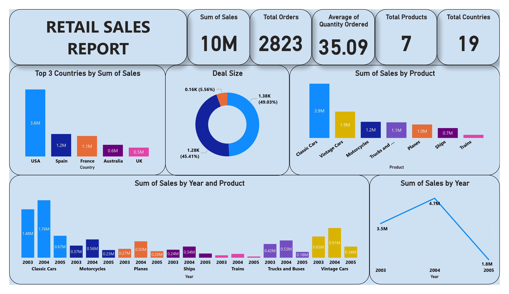

# Retail Sales Report

## Table of Contents
- [Project Overview](#project-overview)
- [Data Sources](#data-sources)
- [Tools](#tools)
- [Data Cleaning/Preparation](#data-cleaningpreparation)
- [Exploratory Data Analysis](#exploratory-data-analysis)
- [Data Analysis](#data-analysis)
- [Results/Findings](#resultsfindings)
- [Limitations](#limitations)

### Project Overview
---
While understanding customer buying habits and product performance is crucial for success in the retail industry, vast amounts of data can be overwhelming. This project, undertaken during my internship at HNG Tech, a leading tech company fostering innovation, tackles this challenge. We explored a publicly available retail sales dataset downloaded from Kaggle. Our goal?  To gain a quick grasp of the data and identify initial trends through data exploration and visualization techniques within Excel and PowerBI.  By delving into key sales metrics and product categories, this "first glance" analysis will provide a springboard for further investigation and data-driven insights to optimize retail strategies.

### Data Sources

The project leverages a public dataset from kaggle, sales_data_sample.csv, the file has 25 Columns and 2824 rows, for our analysis, we focused on the following columns, ORDERNUMBER, QUANTITYORDERED, QTR_ID, YEAR_ID, PRODUCTLINE, SALES, SHIPPED.

### Tools
  - Microsoft Excel - Univariate and Data Analysis
  - Microsoft PowerBI - Data Visualization
  - Power Query - Data Processing and Preparation
 
### Data Cleaning/Preparation

In the data preparation phase, we performed the following tasks:
1. Data loading and inspection
2. Data cleaning and formatting

### Exploratory Data Analysis

EDA involved exploring the datasets to answer key questions such as:
- What are the overall sales trends over time (daily, weekly, monthly, yearly)? Are there any seasonal patterns?
- How do sales vary across different product categories or locations?
- Which products are the best sellers and which are underperforming?
- How much do customers typically spend per transaction?
- Are there any outliers in the data that require further investigation?

### Data Analysis
- Summarized key sales metrics: You calculated total sales, average order value, number of orders, and order size distribution.
- Identified sales trends: You analyzed sales performance by product category and year, finding Classic Cars as the top seller with a peak in 2004.
- Examined customer behavior: You explored the customer base, including the number of countries represented, top spending countries (US, Spain, France), and order size preferences (leaning towards smaller quantities).
- Identified potential areas for improvement: You highlighted the need to improve order fulfillment success rate and explore upselling/bundling strategies based on order size trends.

### Results/Findings
- Strong overall sales: Total sales reached $10 million, indicating a healthy business.
- Diverse customer base: Orders came from 19 countries, with strong international demand from the US, Spain, and France.
- Top performing products: Classic Cars dominated sales, followed by Vintage Cars and Motorcycles.
- Customer preference for smaller orders: Nearly half of orders fell in the "Medium" and "Small" category.
- Order fulfillment success rate: A rate of 92.7% indicates room for improvement in order fulfillment processes.
- Order size distribution: The dominance of smaller orders suggests potential for upselling or product bundling strategies.
- Limited data for 2005: Incomplete data for 2005 could be skewing sales trends by year.

### Conclusion
Conclusion
This initial data exploration provided a promising glimpse into the retail sales landscape. Key findings highlight a strong overall performance with $10 million in total sales and a diverse customer base spanning 19 countries. Top-performing products and strong international demand in specific regions (US, Spain, France) offer valuable insights for future strategies.

Limitations
However, this "first glance" also reveals limitations that warrant further investigation:

- Limited data scope: The analysis only covered data from 2003 to 2005, with incomplete data for 2005 potentially skewing sales trends.
- Lack of customer demographics: Without demographic information, a deeper understanding of customer behavior linked to order size distribution is limited.
- Limited product category analysis: While top sellers were identified, a deeper dive into individual product performance within categories is needed.
- These limitations highlight the potential for even richer insights with a more comprehensive data set and further analysis.

Overall, this project serves as a springboard for data-driven decision making in retail strategies. By addressing the limitations and delving deeper into the data, retailers can unlock a wealth of knowledge to optimize product offerings, target marketing strategies, and ultimately maximize customer satisfaction and profitability.
